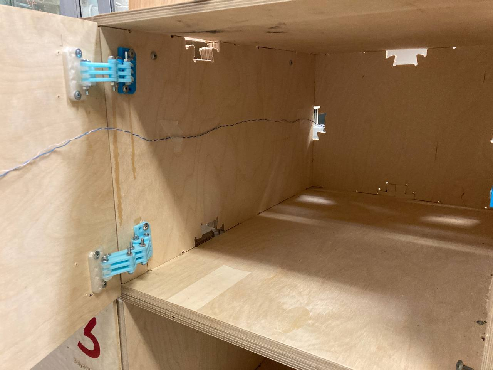

# Lockers
Создание  собственного ящика для хранения предметов

**Задача**: сделать дверцу и персональный локер для хранение деталей проектов в
FabLab. Дверца будет снабжена элктронным замком. Для доступа к локеру будет
использоваться персональная RFID-метка.

**Цели**: практика работы с фрезерным станком.

**Набор материалов**: соленоид, RFID-метка, листовая фанера 6 и 12 мм, саморезы,
болты/гайки.

**Использованные инструменты**: принтер Prusa 3S, фрезерный станок, компьютерные программы - SolidWorks, PtusaSlicer, ArtCam.

# Печать петель

Находим готвую модель петель на [Thigiverse](https://www.thingiverse.com/thing:2401035). Печатаем и собираем как на фото.

Рисунок 1 - Пример готовой сборки петли

# Определение размеров

Дверца должна устанавливаться внахлест, без зазоров или выступов за границы стенок стеллажа.

Рисунок 2 - Расположение состовляющих на дверце локера

# Раскрой фанеры для дверцы и обработка

Вырезаем из листовой фанеры (6 мм) дверцу нужного размера на фрезерном станок для раскроя и
шлифовальную машину для обработки краев.

Рисунок 3 - Вид раскроеной дверцы

# Индексация локера

На лазерном станке на дверце выгравировали фамилию и имя шрифтом Robot Light.

# Разработка RFID-аксессуара

Разработал 3Д модель и напечатал на принтере аксессуар для метки.

Рисунок 4 - RFID-аксессуар

# Раскрой ящиков локера

Так как на всех ящиков не хватило, была проведена раскройка из листов фанеры глубиной 12 мм стенок ящика на фрезерном станке. Были использованы чертежи прошлых лет.

https://github.com/Alberyn/Lockers/assets/78211591/03cf7436-8f13-48c2-b793-3c09db340c86

Рисунок 5 - Сборка ящиков совместно с Евгением и Даниилом

В процессе сборки выявились проблемы с чертежами, детали скрепляющие ящики между собой были больше отверстий под них, поэтому дополнительно была проведена шлифовка деталей для сборки.

Рисунок 6 - Собранный корпус локеров

# Разработка и установка замка

В качестве замка использовалась модель представленная в инструкции к данной работе. STL модели напечатанного замка можно найти в соответствующей папке. Соленоид приклеен к планке с помощью клея и удлинен провод соленоида с помощью пайки и провода.

# Сборка локера

В процессе привинчивания петель, они сломались, слои разъединились друг от друга, поэтому пришлось напечатать и заменить две петли (выделеная деталь на рисунке 7). Возможная причина поломки - использован старый пластик для печати.

Рисунок 7 - Замененная деталь

Рисунок 8 - Собранный локер

# Подключение замка к RFID-считывателю

Было проведена сборка дверцев с ящиками и подключение соленоида к панели с RFID-считывателем. Провод от соленоида к считывателю прикреплен к стенкам ящика бумажным скотчем.

Рисунок 9 - Провод соленоида

# Тестирование локера

Замок работает, открывается после считывания метки.

https://github.com/Alberyn/Lockers/assets/78211591/625d2b64-90a0-4865-93a4-65206a623392

